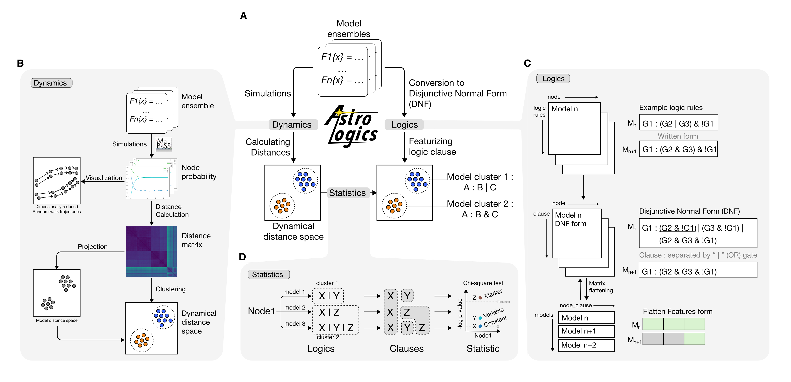

# An analysis framework for monotonous Boolean model ensemble
[](https://doi.org/10.5281/zenodo.21460314)[](https://pypi.org/project/astrologics/)[](https://anaconda.org/colomoto/astrologics/)


This is a repository of data, code and analyses of AstroLogics framework.
A step-by step tutorial can be found in the folder tutorial. Please have a look at our [tutorials](https://astrologics.readthedocs.io/en/latest/tutorials.html). 

## Overview
AstroLogics is a Python package designed for analysing monotonous Boolean model ensemble, a product of Boolean model synthesis from method such as [Bonesis](https://bnediction.github.io/bonesis/index.html).


Our framework includes two major processes 
1. Dynamical properties analysis : 
    - Calculate distance between models through probabilistic approximation via [MaBoSS](https://github.com/sysbio-curie/MaBoSS).
2. Logical function evaluation : 
    - Feature logical equations and identify key logical features between model clusters
3. Statistical analysis :
    - Perform statistical analysis between model clusters to identify key logical features between clusters

<p align="center">

<br>
<em> Overview of the framework showing the two major processes in the framework. <strong>Dynamics</strong>: dynamical properties analysis. <strong>Logics</strong>: Logical function evaluation 
<strong>Statistics</strong>: statistical framework to link model's logic with statistics.
</em>
</br>
</p>

## Getting Started
### Requirements (for AstroLogics)
- Python version 3.8 or greater
- Python's packages listed here:
    - pandas
    - numpy
    - scipy, sklearn
    - maboss
    - boolsim
    - bonesis
    - mpbn
### Installation 

There are several ways to install AstroLogics

#### PyPi

```

pip install astrologics

```

#### Conda
```

conda install -c colomoto astrologics

```

#### From source
First clone this directory:
```

git clone https://github.com/sysbio-curie/AstroLogics

```

Then install AstroLogics with pip
```

pip install AstroLogics

```

## Tutorials

Tutorials are available as Jupyter notebooks

### Run with Binder

[](https://mybinder.org/v2/gh/sysbio-curie/AstroLogics/main?filepath=AstroLogics)

### Run locally with Docker
To run this notebook using the built docker image, run : 
```

docker run -p 8888:8888 -d sysbiocurie/astrologics

```

### Run locally with Conda
Creating the conda environment
```

conda env create --file environment.yml

```

To activate it : 
```

conda activate astrologics

```

To run the notebook: 

```
jupyter-lab

```

## Documentation

Our documentation is available on [ReadTheDocs](https://astrologics.readthedocs.io/)

## Citing AstroLogics
The manuscript of AstroLogics has been submitted. 
In the mean time, the pre-print version can be found at https://www.biorxiv.org/content/10.1101/2025.11.17.688236v1