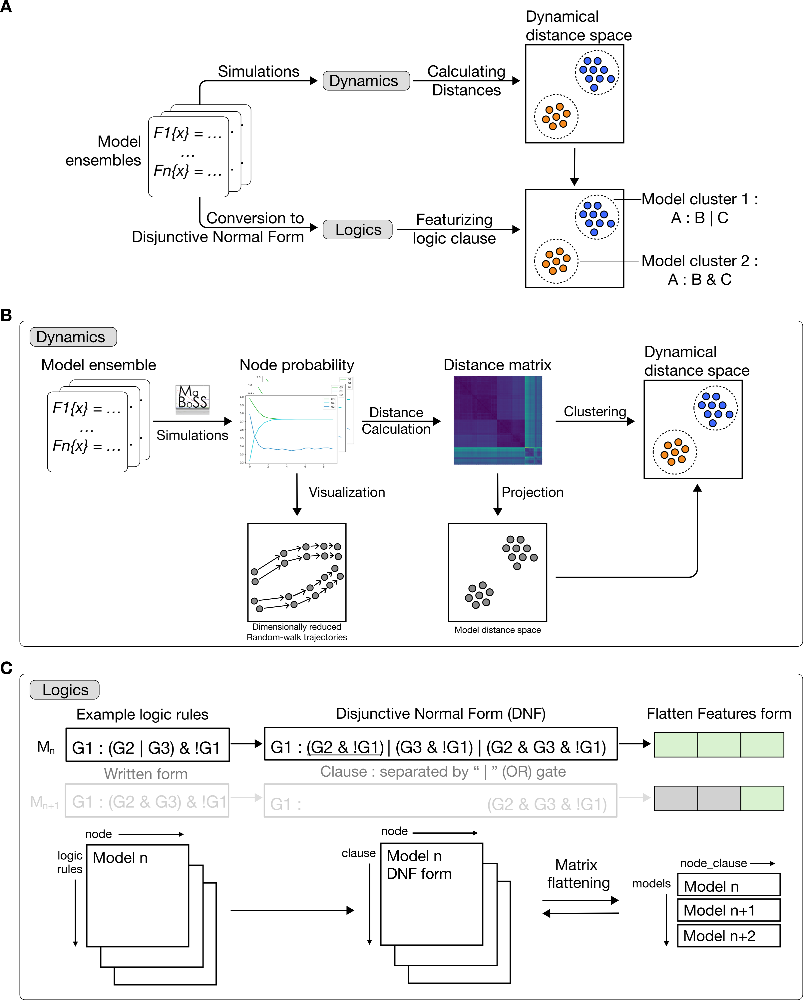

.. AstroLogics documentation master file, created by
   sphinx-quickstart on Tue Aug  5 11:04:02 2025.
   You can adapt this file completely to your liking, but it should at least
   contain the root `toctree` directive.

AstroLogics : An analysis framework for monotonous Boolean model ensemble
=========================================================================

AstroLogics is a Python package designed for analysing monotonous Boolean model ensemble, a product of Boolean model synthesis from method such as Bonesis.

Our framework includes two major processes 

1. Dynamical properties analysis : 

    - Calculated distance between models through probabilistic approxmition via `MaBoSS <https://maboss.curie.fr/>`_.
    
2. Logical function evaluation : 

    - Features logical equation and identify key logical features between model clusters

.. toctree::
   :maxdepth: 1
   :hidden:
   
   installation.rst
   tutorials.rst
   api/modules.rst

